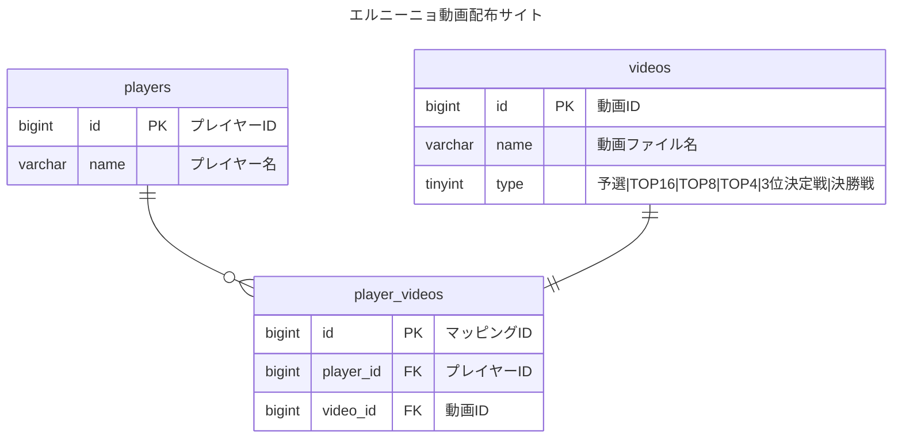

## DB設計

## インフラ設計
- ホスティング
	- AppRun(さくらインターネット)
		- beta版で今だと無料で使えるので
- オブジェクトストレージ(動画ファイル保存先)
	- R2(Cloudflare)
		- 以前作った動画サイトでも使っていたので
- データベース
	- スプレッドシート
		- 今回程度の内容であればわざわざRDB用意しなくていいかな

## アプリ設計

- アプリケーションは基本Next.js一本
- R2と通信するためにAPI立てる必要があるかもしれない

## 画面設計

- `/`: TOPページ
	- プレイヤーの一覧情報を表示
		- エントリーNo
		- プレイヤー名
		- プレイヤーページへのリンク
- `/players/{players.id}`: プレイヤーページ
	- プレイヤーに紐づく動画一覧
		- 動画ファイル名
		- 動画のDLリンク
- `/admin`: 管理者ページ
	- このページとその配下ページではBasic認証が必要
	- プレイヤーと動画それぞれの管理ページへのリンク
	- `/admin/players`: プレイヤー管理ページ
		- プレイヤーの一覧が表示される
			- プレイヤーの作成(リンク)
			- プレイヤーの削除
			- プレイヤーの編集(リンク)
		- `/admin/players/new`
			- プレイヤー作成ページ
		- `/admin/players/{players.id}/edit`
			- プレイヤー編集ページ
	- `/admin/videos`: 動画管理ページ
		- 動画の一覧が表示される
			- 動画の登録(リンク)
			- 動画の削除
			- 動画の編集(リンク)
		- `/admin/videos/new`
			- 動画の登録ページ
		- `/admin/videos/{videos.id}/edit`
			- 動画の編集ページ

## API設計
- 前提条件
	- GET以外のAPIは、すべてBasic認証付き
- Next.js(AppRouter)を利用するのでAPIにする必要がないかも
### GET `/apis/players`
プレイヤー一覧を取得
#### request
#### response
```json
[{
	"id": 1,
	"name": "hoge"
}]
```

### GET `/apis/videos`
動画一覧を取得
#### request
`player`パラメータがない場合は全動画分取得する。
`player`パラメータがある場合は該当するプレイヤーに紐づく動画のみ取得する。
```json
{
	"player": 1
}
```
#### response
```json
[{
	"id": 1,
	"name": "hoeghoge.mp4",
	"type": 1,
	"players": [{
		"id": 1,
		"name": "hoge"
	}]
}]
```

### POST `/apis/players`
プレイヤーの新規作成
#### request
```json
{
	"name": "hoge"
}
```
#### response

### PUT `/apis/players/{players.id}`
プレイヤーの更新
#### request
```json
{
	"name": "hoge"
}
```
#### response

### DELETE `/apis/players/{players.id}`
プレイヤーの削除
#### request
#### response

### POST `/apis/videos`
動画の登録
#### request
```json
{
	"name": "hoge.mp4",
	"type": "予選",
	"players": [1]
}
```
### PUT `/apis/videos/{videos.id}`
動画の更新
#### request
```json
{
	"type": "TOP16",
	"players": [1,2]
}
```
#### response

### DELETE `/apis/videos/{videos.id}`
動画の削除
#### request
#### response